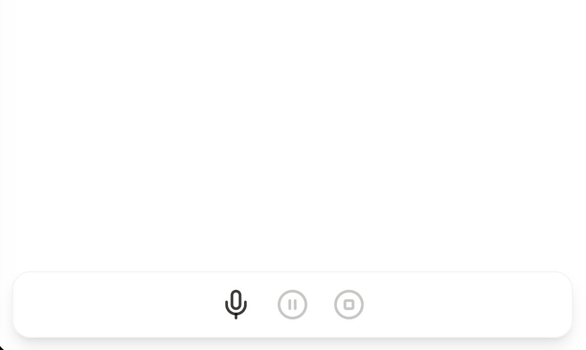
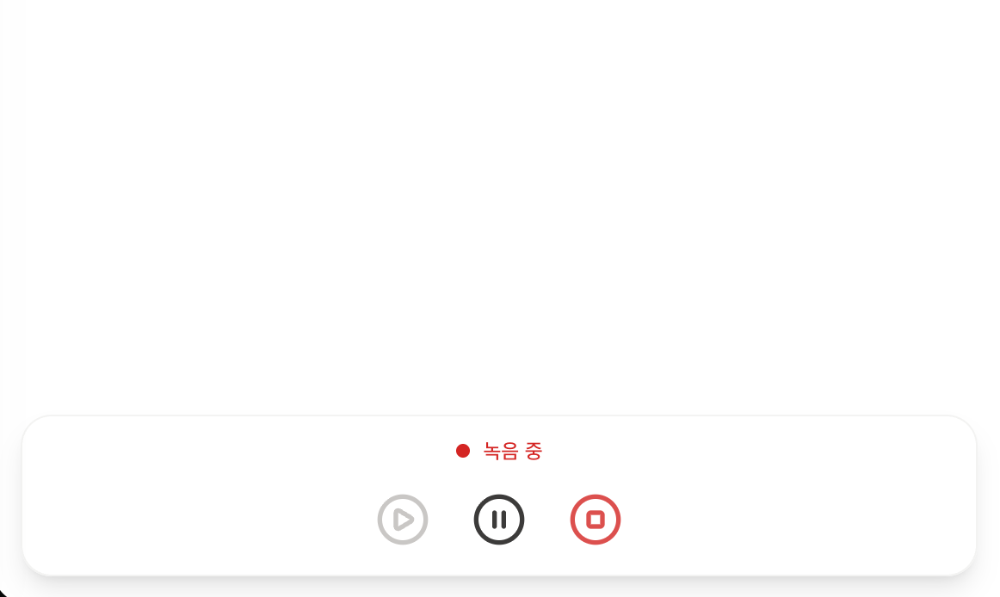
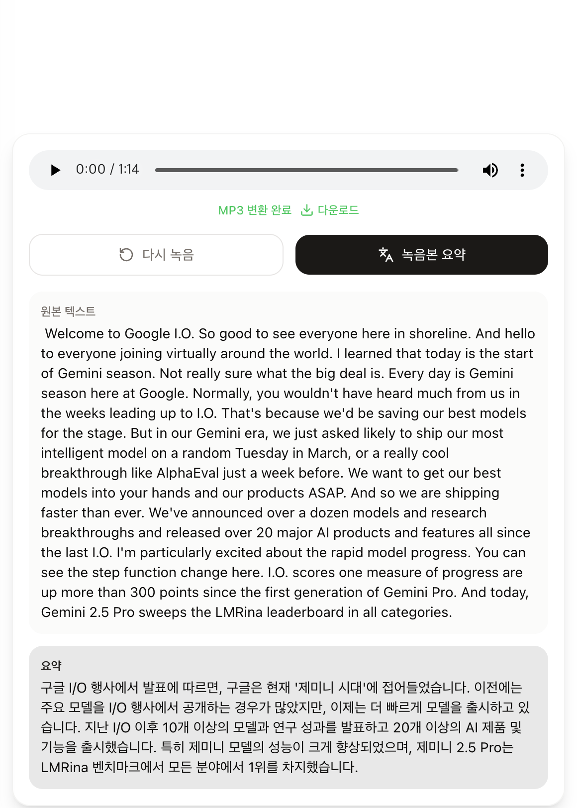
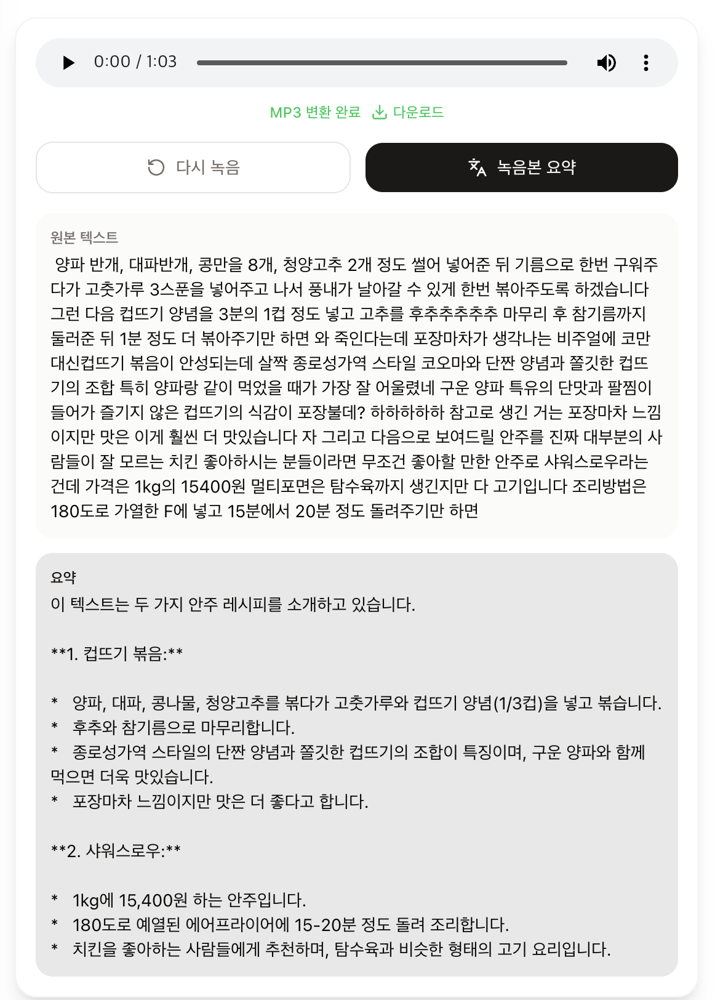

# mamago Web Client

음성 녹음, 텍스트 요약을 위한 웹 클라이언트 PoC

## 프로젝트 구조

```
app/                    # Next.js App Router (라우팅)
routes/                 # 라우트 컴포넌트
features/               # 기능 모듈 (hook, ui)
  ├── chat/             #   녹음 제어, FFmpeg 변환
  └── home/             #   홈 진입 버튼
widgets/                # 레이아웃, 컨테이너
components/             # 공용 UI 컴포넌트
shared/                 # 타입, 유틸, 설정
public/
  ├── ffmpeg-assets/    # FFmpeg WASM 에셋
  └── workers/          # FFmpeg Web Worker 소스
```

## 주요 기능

- **음성 녹음** — 마이크 권한 요청 → 녹음(일시정지/재개) → 정지
- **WebM → MP3 변환** — FFmpeg WASM을 Web Worker에서 실행하여 메인 스레드 블로킹 없이 클라이언트 사이드 변환
- **오디오 미리듣기 & 다운로드** — 녹음 종료 후, webm -> mp3 변환, 그리고 변환된 MP3 파일 재생 및 다운로드
- **요약 정리(예정)** - '요약 시작' 버튼 클릭 후 서버(FastAPI-Server)로 MP3 파일 보내서 STT -> LLM을 통해 요약 진행
  - [FastAPI Server 레포지터리 주소](https://github.com/lunaticscode/mamago-fastapi-was)
- **채팅 히스토리** — 사이드바를 통한 이전 대화 내역 탐색

## 앱 실행화면

### 미디어 인터페이스



### 녹음 진행



### 녹음 종료 후, 요약 결과(1)



### 녹음 종료 후, 요약 결과(2)


